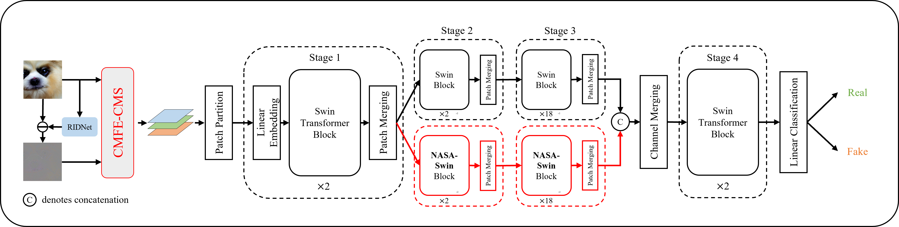

# NASA-Swin

**Official Pytorch Implementation of the Paper:**

> [Noise-Informed Diffusion-Generated Image Detection With Anomaly Attention](https://ieeexplore.ieee.org/abstract/document/11018089?casa_token=GYs4jsjcvjEAAAAA:2D4VOC8LuuCYYDtjdVOlQ04lx8xKDnTte81qGaQC0_82sv8DqrER_uSEJJzjLkUStniKFx7uOFUo)
> 
> **Weinan Guan, Wei Wang\*, Bo Peng, Ziwen He, Jing Dong, Haonan Cheng**
> 
> *TIFS, 2025*
> 

## Data Preparation

**In our experiments, we utilize [GenImage Dataset](https://proceedings.neurips.cc/paper_files/paper/2023/file/f4d4a021f9051a6c18183b059117e8b5-Paper-Datasets_and_Benchmarks.pdf) as the training and evaluation data. You can download the dataset by following the instrcutions from [GenImage Github Repo](https://github.com/GenImage-Dataset/GenImage) and put them in the directory [data/GenImage](data/GenImage)**

## Pretrained Model

We provide [the weight](https://drive.google.com/file/d/1zC85n8E41VfdkfdO53aYzuboFwB9ntDc/view?usp=sharing) of our NASA-Swin-Base trained on **GenImage Dataset**.

## Installation
```
conda create -n NASA python==3.10.9
conda activate NASA
```
Pleaser refer to [the requirments.txt](requirements.txt) to prepare your environment.

## Inference

We provide an inference code on the subsets of GenImage Dataset. You can run the codes to reproduce our results in Table I and Table II.

```
CUDA_VISIBLE_DEVICES=0[gpu_id] python inference_dataset.py \
         -w checkpoint/NASA-Swin-base.tar \
         -r data/GenImage/ \
         -d ADM [The Subset Name of GenImage Dataset]
```

## License
Our code and pretrained model are freely available for research purpose.

For commercial use: 
- A license agreement is required. 
- See the [license](LICENSE) for more details and contact the author [Weinan Guan](mailto:weinanguan@cuhk.edu.cn) and [Wei Wang](mailto:wwang@nlpr.ia.ac.cn).

## Citation
If you find our work useful for your research, please consider citing our paper:

```
@article{guan2025noise,
  title={Noise-Informed Diffusion-Generated Image Detection with Anomaly Attention},
  author={Guan, Weinan and Wang, Wei and Peng, Bo and He, Ziwen and Dong, Jing and Cheng, Haonan},
  journal={IEEE Transactions on Information Forensics and Security},
  year={2025},
  publisher={IEEE}
}
```
